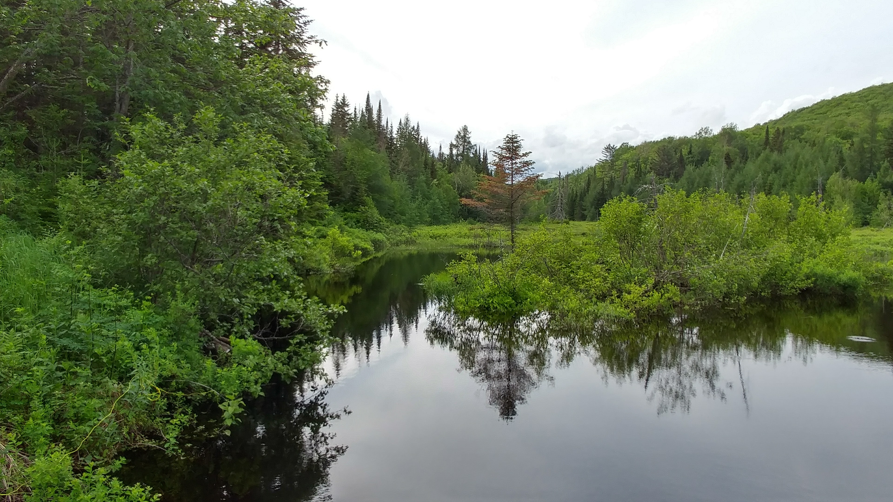

<h1> A little background </h1>

I have always been captivated by the unexpected and intriguing phenomena that arise in the study of biology. It was then only natural for me to gravitate towards atypical reproductive processes, which led me to pursue a PhD project focused on understanding the reproduction of the diploid and triploid hybrid fish <i>Chrosomus eos-neogaeus</i>. 

<figcaption>Some field work during my PhD</figcaption>
</img-div>

As a first-generation scholar and woman from a modest background, I've navigated significant challenges in pursuing my academic and professional goals in science. These experiences, however, have forged a deep well of resilience, determination, and a passionate commitment to scientific advancement.

Throughout my journey, I've learned the value of perseverance, hard work, and the power of collaborative learning. I'm incredibly proud of my accomplishments and deeply grateful to the mentors, colleagues, and loved ones who have supported me.

My experiences have fueled my desire to cultivate a more diverse, equitable, and inclusive scientific community, where individuals from all backgrounds can thrive and contribute their unique perspectives.

This vision, I believe, starts with customized teaching and mentoring approaches that acknowledge each mentee's past experiences and future aspirations. By tailoring our guidance, we can empower them to excel and reach their full potential.

As for my hobbies, I am found of nature, and will always be surprise by how diverse it can be. My hobbies includes wildlife photography, arts (mostly with natural subjects) and taking care of my three lovely cats! 

<figcaption>Some places where we went for fish samplings during my PhD</figcaption>
</img-div>

<!-- Back to top button -->
<button type="button" class="btn btn-danger btn-floating btn-lg" id="btn-back-to-top">
  <i class="fas fa-arrow-up"></i>
</button>

