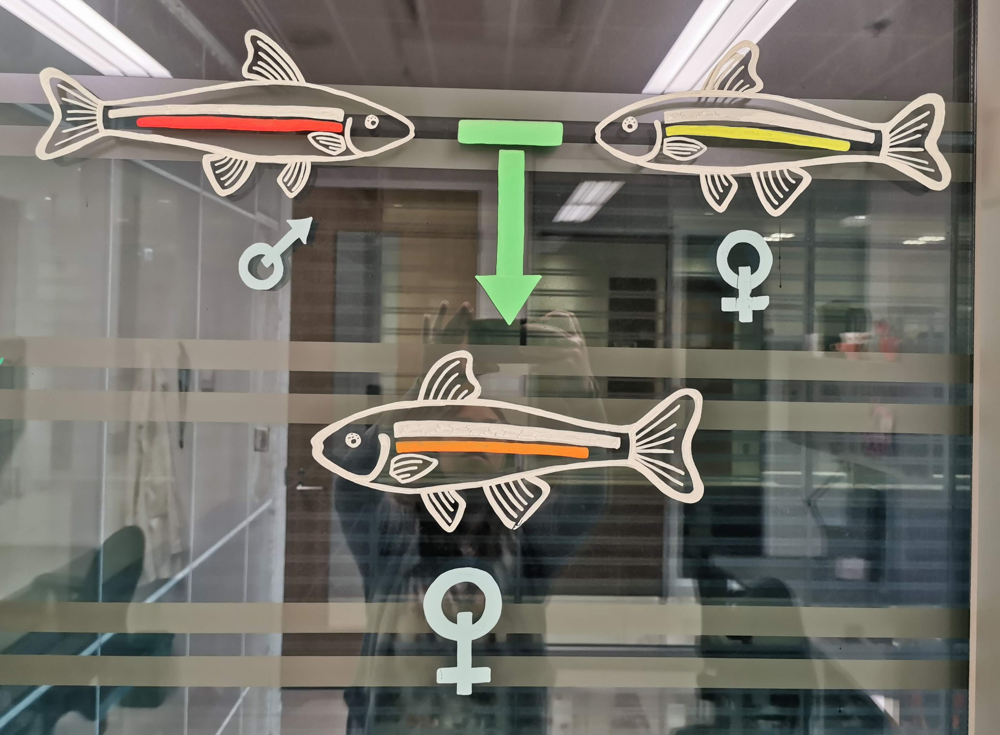

<h1> Postdoctoral Research </h1>

 I started my first postdoctoal experience in the lab of <a href="https://www.zoology.ubc.ca/mank-lab/">Dr. Judith Mank</a> (University of British Columbia) as of January 2024. My aim in this lab is to investigate sex chromosomes evolution, namely in the light of sexual conflicts. Stay tuned for more exciting research! 

<h1> PhD Research </h1>

 Jumping to the PhD right after completing my BSc, I landed in a lab that opened the world of atypical reproductions to me. I was instantly fascinated by the unexpected and unconventional ways that life has to transmit itself to the next generation.

The <i>Chrosomus eos-neogaeus</i> hybrid complex is a unique and fascinating study group due to its exceptional combination of sexual and asexual reproduction, polyploidy, and of course hybridization. For my PhD, my research objectives were multifaceted, as I aimed to identify the various reproductive pathways observed in these fish, characterize the origin of the reproductive dichotomy in the triploids, and the impacts of such phenotypic changes on the fish themselves.

By studying this complex, I sought to uncover the functioning of reproduction in aberrant cases, shedding new light on the diverse and complex processes that drive life on Earth. Through my research, I hope to contribute to a better understanding of the fascinating and intricate world of biology. 

<figcaption style="text-align: center"><i>Chrosomus eos-neogaeus</i> hybrids.</figcaption>
</img-div>

## Atypical reproductive pathways

My <a href="https://academic.oup.com/jhered/article/110/3/370/5268115">first research project</a> focused on how <i>Chrosomus eos x eos-neogaeus</i> triploid hybrids were able to perpetuate themselves. We had, at that point, many reasons to think their reproductive success was low. However, we actually found that half of the triploid females crossed for the experiment harboured offspring through meiotic hybridogenesis, while the other half produced offspring through another, unknown type of gametogenesis, named <i>ameiotic hybridogenesis</i>. As well, the different types of hybridogenesis occurred in an exclusive manner, with females being able to do only one and never a mix of the two! This research shedded new light on the population dynamics of this complex and revealed a more complex picture than previously thought (Figure A). 

<figcaption style="text-align: center">Figure A. <i>Chrosomus eos x eos-neogaeus</i> reproductive pathways, and main results of my first chapter.</figcaption>
</img-div>

## Maternal effects and gametogenesis

In that <a href="https://onlinelibrary.wiley.com/doi/full/10.1111/mec.17264">second research project</a>, we worked on uncovering the mechanism which produced the reproductive dichotomy in triploid hybrids. We found out that epigenetic patterns in females of a certain reproduction group was concordant with the epigenetic patterns of young larvae, raised in common garden conditions, according to their maternal origin. Indeed, it was found that the ploidy of the hybrid mothers would impact the larvae's gonadal development, leading to either reproductive pathway (Figure B). 

<figcaption style="text-align: center">Figure B. The origin of the <i>Chrosomus eos x eos-neogaeus</i> reproductive pathways, and main results of my second chapter.</figcaption>
</img-div>

## The shape of asexuality

Incoming! 

<!-- Back to top button -->
<button type="button" class="btn btn-danger btn-floating btn-lg" id="btn-back-to-top">
  <i class="fas fa-arrow-up"></i>
</button>

