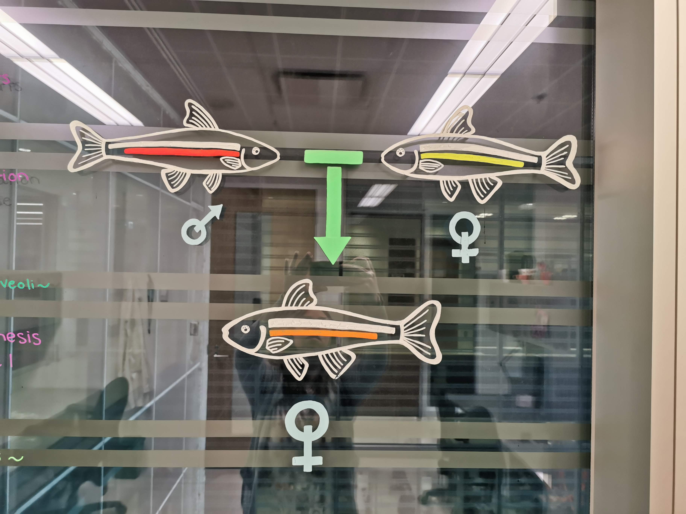

<h1>Research Direction</h1>

Reproduction is a fundamental process shaping the ecology and evolution of eukaryotic organisms. While sexual reproduction dominates most vertebrate lineages, alternative reproductive modes such as asexuality, hybridogenesis, self-fertilization, and other atypical systems are widespread across the tree of life. These reproductive strategies can profoundly influence genetic diversity, adaptation, population persistence, and species diversification.

My research focuses on understanding how variation in reproductive systems shapes evolutionary trajectories. In particular, I am interested in the interactions among hybridization, genome evolution, and reproductive mode transitions. Hybridization can disrupt established reproductive processes, but it can also generate novel genetic variation, facilitate adaptation, and contribute to the origin of new lineages. At the same time, atypical reproductive systems provide unique opportunities to investigate fundamental questions about development, inheritance, and evolution.

<h1> Postdoctoral Research </h1>

My postdoctoral research explores how reproductive systems shape genome evolution across diverse taxa. By combining comparative genomics, evolutionary biology, and population genetics, I investigate how shifts in reproductive mode and sex determination influence fundamental evolutionary processes.

Since January 2026, I have been an FRQ Postdoctoral Fellow in the laboratory of Stephen Wright in the Department of Ecology & Evolutionary Biology at the University of Toronto. My current research have a focus on how mutation rates evolve in response to different reproductive modes, with the goal of understanding how changes in reproduction influence genome stability, adaptation, and long-term evolutionary dynamics. I recently published a <a href="https://ecoevorxiv.org/repository/view/14788/">preprint</a> on that matter. 

Previously, from January 2024 to December 2025, I was an FRQ Postdoctoral Fellow (and Postdoctoral Researcher until May 2025) in the laboratory of Judith E. Mank at the University of British Columbia. There, I investigated the evolution of sex chromosomes in Poecilia species, focusing on how dosage compensation and recombination suppression contribute to sex chromosome divergence and genome evolution. My paper was recently published in <a href="https://onlinelibrary.wiley.com/doi/abs/10.1111/mec.70353">Molecular Ecology</a>.

<h1> PhD Research </h1>

During my PhD, I studied the <i>Chrosomus eos-neogaeus</i> hybrid complex, a remarkable system combining hybridization, polyploidy, and both sexual and asexual reproduction. This work provided a unique opportunity to investigate how unusual reproductive systems originate and persist, and how they influence organismal biology.

My research revealed previously unknown reproductive pathways in triploid hybrids, uncovered evidence that maternal effects and epigenetic mechanisms may influence reproductive development, and demonstrated that reproductive mode is associated with broader phenotypic differences beyond the reproductive system itself. Together, these findings highlighted the complexity of reproductive transitions and their developmental and evolutionary consequences.

More broadly, my PhD contributed to understanding how hybridization and atypical reproductive modes interact to generate biological diversity, providing new insights into the evolutionary processes that shape vertebrate populations.

<figcaption style="text-align: center"><i>Chrosomus eos-neogaeus</i> hybrids.</figcaption>
</img-div>

<!-- Back to top button -->
<button type="button" class="btn btn-danger btn-floating btn-lg" id="btn-back-to-top">
  <i class="fas fa-arrow-up"></i>
</button>

  