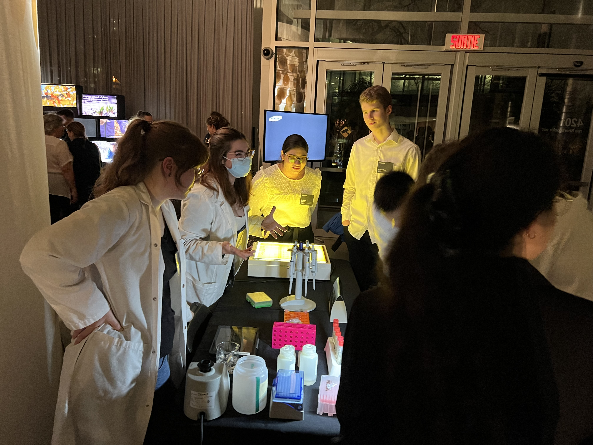

<h1>Outreach</h1>

Outreach activities are of the outmost importance in science. As what we do at the lab might be obscure for some, outreach and vulgarisation can break that separation between the world
of scientists and that of the public. It allows to educate, of course, but also to provoke curiosity, passion and wonder in each and everyone. As such, I aimed as a graduate student to 
share that knowledge, but also my passion for my work. In that matter, the Researchers' Night has always been one of my favorite event! We got to meet people from all ages and backgrounds,
and both edition were was such nice events. I hope to be able to take part in such activities again in the future.

<figcaption style="text-align: center">Researchers' Night 2022, at the Montreal Botanical Garden.</figcaption>
</img-div>

<h1>Teaching</h1>

I believe teaching is another crucial aspect of research. Collecting and analyzing data is only the first part of the equation, as for this information to be useful, it needs to be transferred efficiently – not just to other researchers, but to the next generation. During my teaching role, I found that many aspects of my research dovetailed with the subjects I taught, allowing me to introduce students to the world of research while meeting their educational needs. Furthermore, I aimed to foster critical thinking and ignite students' passion for genetics and evolution, as well as positively influence their growth. Such experience did not only benefitted students, but my personal and professional improvement as well. It enhanced my abilities as a researcher by pushing me to be creative and improve my communication and vulgarization skills. 

Teaching is thus an essential part of being a university researcher. I had the opportunity to give 7 classes of a course in Winter 2020 (Evolutionnary Genetics). It was a real challenge, but such a satisfying one! Here's the content I teached: 

<ol>
<li>Repeated sequences (tandem elements)</li>
<li>Repeated sequences (transposable elements)</li>
<li>Epigenetics (internal factors)</li>
<li>Epigenetics (environmental factors)</li>
<li>Sex (Reproduction and mating systems)</li>
<li>Sex (Sex determination)</li>
<li>Non-mendelian inheritance</li>
</ol>

<!-- Back to top button -->
<button type="button" class="btn btn-danger btn-floating btn-lg" id="btn-back-to-top">
  <i class="fas fa-arrow-up"></i>
</button>

