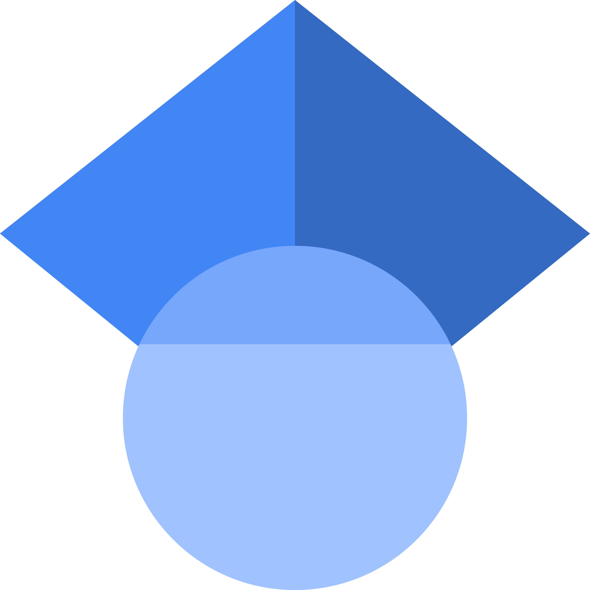

## How to contact me

You can reach out to me or follow my work with these social media and websites. However, the quickest and most certain way to contact me remains my email: joelle.lafond [at] umontreal.ca

  

   

   

  

   

