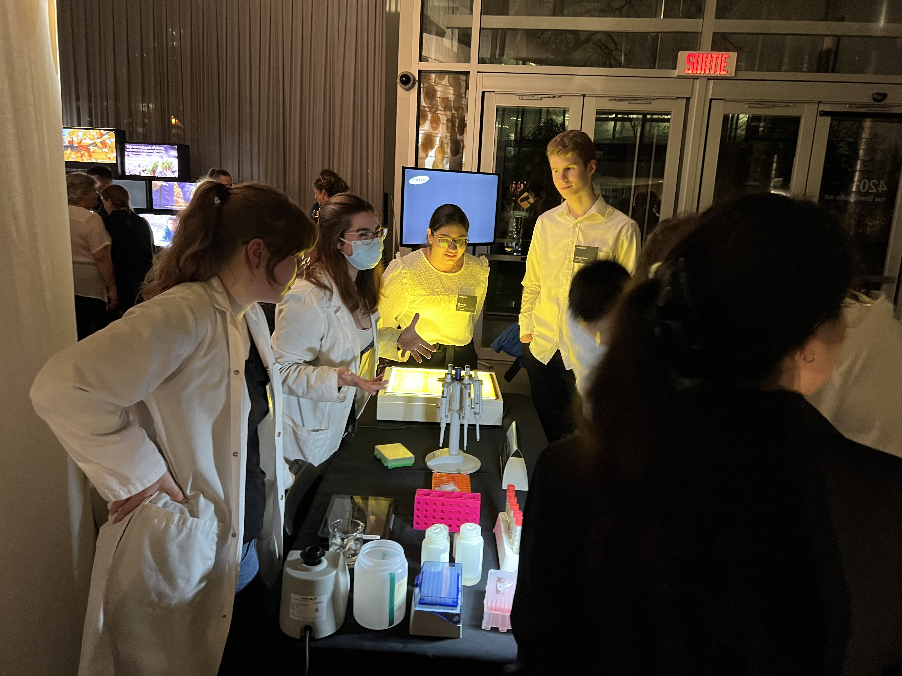

## Outreach

Outreach is of the outmost importance in science. While what we do at the lab might seem obscure for some, outreach can break that separation between the world
of scientists and that of the public. It allows to educate, of course, but also to rise curiosity, passion and wonder in each and everyone. As such, I aimed as a graduate student to 
share that knowledge, but also my passion for my work. In that matter, the Researchers' Night has always been one of my favorite event! We got to meet people from all ages and backgrounds,
and both edition were was such nice events. 

Researchers' Night 2022, at the Montreal Botanical Garden.

## Teaching

I believe teaching is a crucial aspect of research. Collecting and analysing data is only the first part of the equation, as for this information to be useful, it needs to be transferred efficiently – not just to other researchers, but to the next generation of students. During my teaching role, I found that many aspects of my research dovetailed with the subjects I taught, allowing me to introduce students to the world of research while meeting their educational needs. Furthermore, I aimed to foster critical thinking and ignite students' passion for genetics and evolution, as well as positively influence their growth. Such experience did not only benefitted students, but my personal and professional growth as well. It enhanced my abilities as a researcher by pushing me to be creative and improve my communication and vulgarization skills.Teaching is of course also an essential part of being a university researcher. I had the opportunity to give 7 classes of a course in Winter 2020 (Evolutionnary Genetics). It was a real challenge, but such a satisfying one! Here's the content of this half-course: 

<ol>
<li>Repeated sequences (tandem elements)</li>
<li>Repeated sequences (transposable elements)</li>
<li>Epigenetics (internal factors)</li>
<li>Epigenetics (environmental factors)</li>
<li>Sex (Reproduction and mating systems)</li>
<li>Sex (Sex determination)</li>
<li>Non-mendelian inheritance</li>
</ol>

