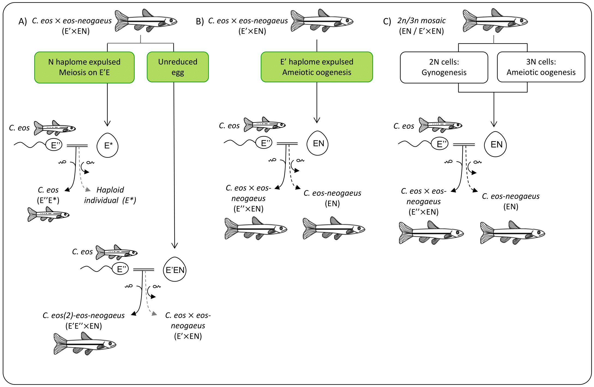

<h1> Postdoctoral Research </h1>

 I started a postdoc in the lab of <a href="https://www.zoology.ubc.ca/mank-lab/">Dr. Judith Mank</a> (University of British Columbia) as of January 2024. My aims in this lab are to investigate  sex chromosomes evolution, namely in the light of sexual conflicts. Stay tuned for more infos! 

<h1> PhD Research </h1>

 Jumping to the PhD right after completing my BSc, I landed in a lab that opened the world of atypical reproductions to me. I was instantly fascinated by the unexpected and unconventional ways that life have to transmit itself to the next generation.

The <i>C. eos-neogaeus</i> hybrid complex is a unique and fascinating organism due to its exceptional combination of sexual and asexual reproduction, polyploidy, and hybridization. For my PhD, my research objectives were multifaceted, as I aimed to identify the various reproductive pathways observed in these fish, then and characterize their molecular mechanisms and the impacts of such phenotypic changes on the fish themselves.

By studying this complex, I sought to uncover the functioning of reproduction in aberrant cases, shedding new light on the diverse and complex processes that drive life on Earth. Through my research, I hope to contribute to a better understanding of the fascinating and intricate world of biology. 

## Atypical reproductive pathways

My first research project focused on how triploid hybrids of the fish <i>Chrosomus eos x eos-neogaeus</i> were able to perpetuate themselves. We found that half of the triploid females crossed for the experiment harboured offspring through meiotic hybridogenesis, while the other half produced offspring through ameiotic hybridogenesis. As well, the different types of hybridogenesis occurred in an exclusive manner, with female being able to do only one and never a mix of the two! This research shedded new light on the population dynamics of this complex and revealed a more complicated picture than previously thought (see Figure A). See the paper here : <a href="https://academic.oup.com/jhered/article/110/3/370/5268115">Oogenesis in <i>C. eos x eos-neogaeus</i></a>. 

<figcaption style="text-align: center">Figure A. <i>Chrosomus eos x eos-neogaeus</i> reproductive pathways, and main results of my first chapter.</figcaption>
</img-div>

By studying these processes, we can gain a better understanding of the limits and evolutionary advantages of alternative reproduction strategies. 

## Maternal effects and gametogenesis

Paper just published! 

## Morphometry

Incoming! 

