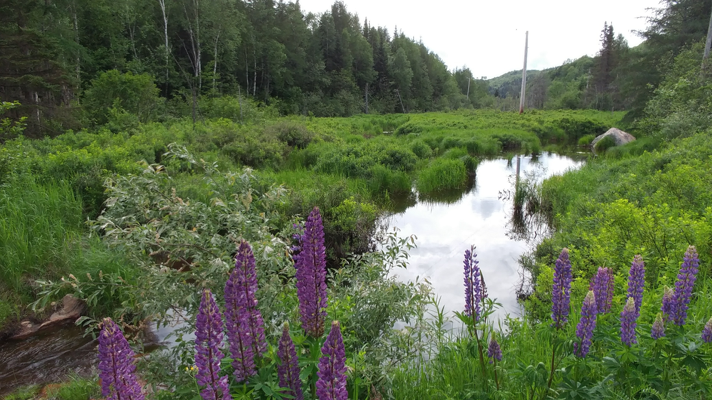
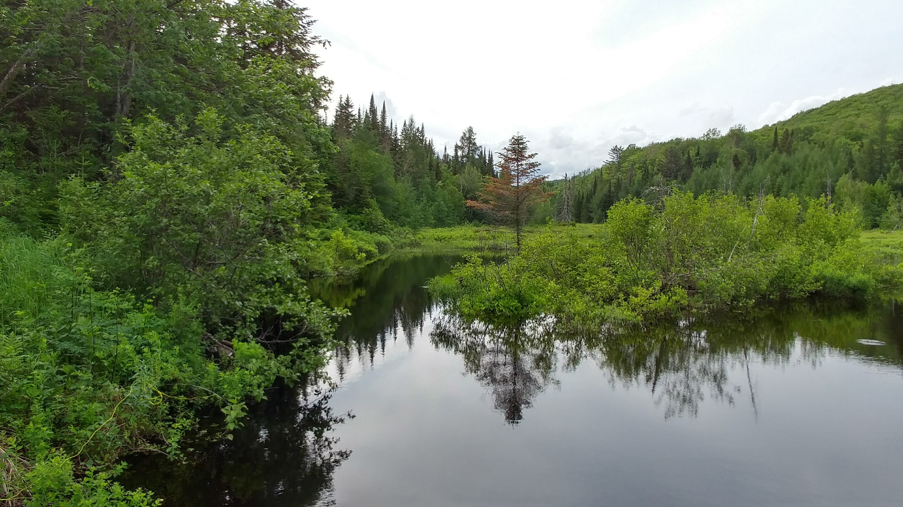

<figcaption style="text-align: center">Some field work</figcaption>

I have always been captivated by the unexpected and intriguing phenomena that arise in the study of biology. It was then only natural for me to gravitate towards atypical reproductive processes, which led me to pursue a PhD project focused on understanding the reproduction of the diploid and triploid hybrid fish <i>Chrosomus eos-neogaeus</i> in the lab of Dr. Bernard Angers (Université de Montréal). I aim to complete my thesis by the end of 2023. 

As a first-generation scholar and woman from a modest background, I have had to overcome significant challenges to pursue my academic and professional goals. However, these experiences have instilled in me a deep sense of resilience, determination, and passion for science.

Through my academic journey, I have learned the importance of perseverance, hard work, and a willingness to learn from others. I am proud of my accomplishments so far and grateful for the support of my mentors, colleagues, and loved ones who have helped me along the way.

I hope to use my experiences and expertise to contribute to a more diverse, equitable, and inclusive scientific community, where individuals from all backgrounds have the opportunity to thrive and succeed.

I am found of nature, and will always be surprise by how diverse it can be. My hobbies includes amateur photography, arts (mostly with natural subjects) and taking care of my three lovely cats! 

<figcaption style="text-align: center">And some places where we went for fish samplings during my PhD</figcaption>